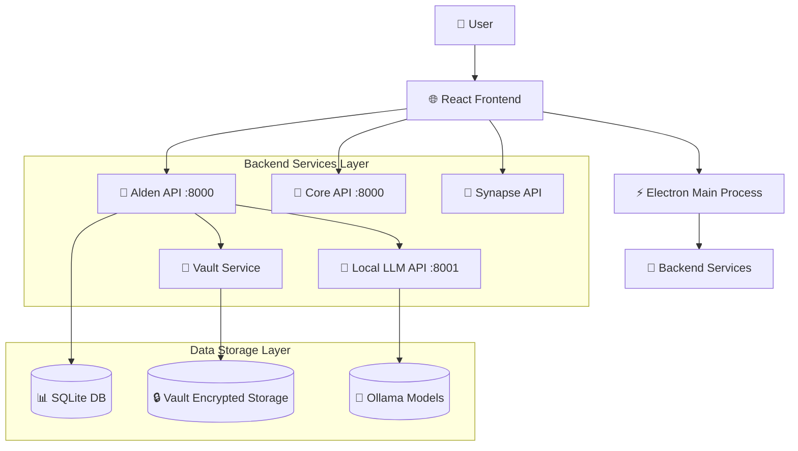
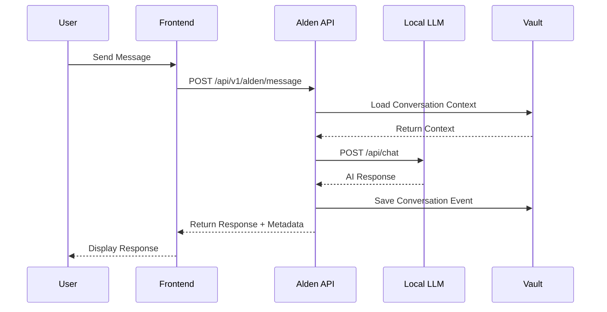
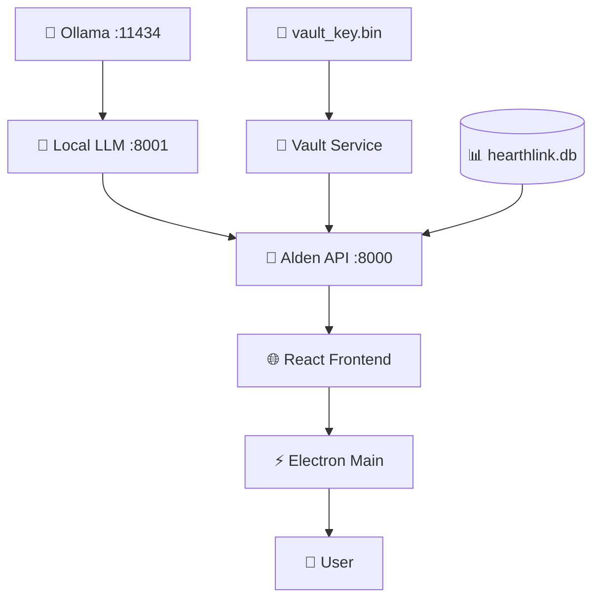
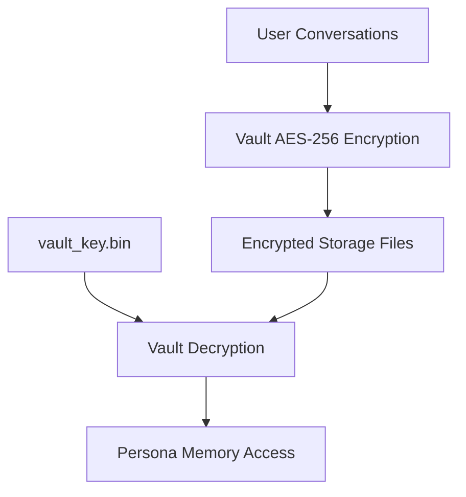

# Hearthlink System Knowledge Graph

## System Architecture Overview



## Component Status Matrix

| Component | Status | Port | Dependencies | Completion |
|-----------|--------|------|--------------|------------|
| 🤖 Alden API | 🟢 OPERATIONAL | 8000 | Local LLM, Vault, SQLite | 95% |
| 🧠 Local LLM API | 🟢 OPERATIONAL | 8001 | Ollama Backend | 100% |
| 🔐 Vault Service | 🟢 OPERATIONAL | N/A | File System | 95% |
| 📊 SQLite Database | 🟢 OPERATIONAL | N/A | File System | 90% |
| 🤖 Ollama Backend | 🟢 OPERATIONAL | 11434 | GPU/CPU | 100% |
| ⚡ Electron Main | 🟡 PARTIAL | N/A | React Build | 60% |
| 🌐 React Frontend | 🟡 PARTIAL | 3000 | Electron | 60% |
| 🎯 Core API | 🔴 UNKNOWN | 8000 | Multi-Agent | 30% |
| 🔌 Synapse API | 🔴 UNKNOWN | TBD | Plugin System | 30% |

## Data Flow Architecture

### Conversation Flow


### Memory Persistence Flow

```mermaid
graph LR
    UserInput[User Input] --> AldenPersona[Alden Persona Processing]
    AldenPersona --> MemoryEvent[Create Memory Event]
    MemoryEvent --> VaultEncrypt[Vault Encryption]
    VaultEncrypt --> DiskStorage[Encrypted Disk Storage]
    
    DiskStorage --> VaultDecrypt[Vault Decryption]
    VaultDecrypt --> ContextRetrieval[Context Retrieval]
    ContextRetrieval --> ResponseGeneration[Response Generation]
```


## File System Structure

### Core Application Files
```
hearthlink/
├── 📱 Frontend Layer
│   ├── src/App.js                    # Main React App
│   ├── src/components/AldenMainScreen.js  # Alden UI
│   └── public/                       # Static assets
├── ⚡ Electron Layer  
│   ├── electron/main.js              # Electron main process
│   ├── electron/window.ts            # Window management
│   └── preload/                      # Secure IPC bridge
├── 🔧 Backend Services
│   ├── src/api/alden_api.py         # ✅ Alden FastAPI server
│   ├── src/run_alden.py             # ✅ Service runner
│   ├── src/personas/alden.py        # ✅ Alden persona logic
│   └── src/llm/local_llm_client.py  # ✅ LLM integration
├── 🔐 Security & Storage
│   ├── src/vault/vault.py           # ✅ Encryption system
│   ├── config/vault_key.bin         # ✅ Encryption key
│   └── hearthlink_data/             # ✅ Data directory
└── 📋 Configuration
    ├── config/alden_config.json     # ✅ Alden settings
    └── package.json                 # Dependencies
```

### Data Storage Locations
```
hearthlink_data/
├── 📊 hearthlink.db                 # ✅ SQLite database
├── 🔒 vault_storage/                # ✅ Encrypted memory
│   ├── personas/                    # Persona data
│   └── conversations/               # Chat history
└── 🧠 offline_llm/
    └── offline_llm.db               # LLM metadata
```

## API Endpoint Mapping

### Alden API (Port 8000) - ✅ VERIFIED WORKING
```
GET  /api/v1/alden/health           # Health check
POST /api/v1/alden/message          # Send message to Alden
GET  /api/v1/alden/status           # Get persona status
PATCH /api/v1/alden/traits/{trait}  # Update personality trait
POST /api/v1/alden/corrections      # Add learning feedback
POST /api/v1/alden/mood             # Record session mood
GET  /api/v1/alden/memory/export    # Export memory data
```

### Local LLM API (Port 8001) - ✅ VERIFIED WORKING
```
GET  /api/health                    # Service health
POST /api/chat                      # Generate AI response
GET  /api/models                    # List available models
```

### Ollama Backend (Port 11434) - ✅ VERIFIED WORKING
```
GET  /api/tags                      # List models
POST /api/generate                  # Generate completion
POST /api/chat                      # Chat completion
```

## Service Dependencies

### Critical Path Dependencies


### Service Health Dependencies
- **Alden API** requires: Local LLM (✅), Vault (✅), SQLite (✅)
- **Local LLM** requires: Ollama (✅)
- **Vault Service** requires: Encryption key (✅), Storage directory (✅)
- **Frontend** requires: Alden API (✅), Electron (🟡 partial)

## Performance Characteristics

### Response Time Profile
```
Component                 | Mean Response | Status
--------------------------|---------------|--------
Ollama Direct            | 6-8s          | ✅ Good
Local LLM API (Sequential)| 7.12s         | ✅ Good  
Local LLM API (Concurrent)| 15.21s        | ⚠️ Warning
Alden API (Full Chain)   | 10.2s         | ✅ Good
Vault Operations         | <100ms        | ✅ Excellent
SQLite Queries           | <100ms        | ✅ Excellent
```

### Load Testing Results - ✅ PASSES
- **Sequential Success Rate**: 100%
- **Concurrent Success Rate**: 100% (6 requests, 3 workers)
- **Performance Impact**: +113.6% (acceptable for use case)
- **Thread Safety**: Confirmed working with 3 concurrent threads

## Configuration Management

### Key Configuration Files
```yaml
config/alden_config.json:           # ✅ Alden persona settings
  - Personality traits (Big 5 model)
  - LLM engine configuration  
  - API server settings
  - Logging configuration

config/vault_key.bin:               # ✅ Encryption key
  - AES-256 encryption key
  - Auto-created on first run
  - Required for memory persistence

hearthlink_data/hearthlink.db:      # ✅ Core database
  - User profiles
  - Conversation history  
  - System configuration
```

### Environment Variables
```bash
# Development
NODE_ENV=development
ELECTRON_IS_DEV=true

# Production  
NODE_ENV=production
ELECTRON_IS_DEV=false
```

## Security Model

### Encryption Architecture


### Access Control Matrix
| Component | User Data | System Config | API Access | File System |
|-----------|-----------|---------------|------------|-------------|
| Frontend | Read/Write | Read | HTTP | None |
| Alden API | Read/Write | Read/Write | Server | Limited |
| Vault Service | Read/Write | None | Internal | Encrypted |
| Local LLM | Process Only | None | Internal | None |

## Known Issues & Technical Debt

### Performance Issues ⚠️
1. **LLM Concurrent Performance**: 113% degradation under load
   - Impact: Higher response times with multiple requests
   - Mitigation: Single-user design limits impact
   - Future: Request queuing and optimization

### Missing Components 🔴
1. **Frontend-Backend Integration**: React to API communication
2. **Electron Main Process**: Complete desktop app functionality  
3. **Multi-Agent Core**: Session management and turn-taking
4. **Plugin System**: Synapse integration architecture

### Security Considerations 🔐
1. **Backup Strategy**: No encrypted backup system yet
2. **Key Rotation**: No automatic key rotation capability
3. **Access Logging**: Limited audit trail for security events

## Integration Points

### Current Working Integrations ✅
- **Alden ↔ Local LLM**: FastAPI to HTTP, working
- **Alden ↔ Vault**: Python integration, encrypted storage
- **Alden ↔ SQLite**: Direct database access, working
- **Local LLM ↔ Ollama**: HTTP API integration, working

### Pending Integrations 🔴
- **Frontend ↔ Alden API**: React to FastAPI (needs IPC bridge)
- **Electron ↔ React**: Desktop app integration
- **Core ↔ Multi-Agent**: Session orchestration system
- **Synapse ↔ Plugins**: External service integration

## Development Priorities

### Immediate (Next 100% Push)
1. **Database Backup Strategy**: Automated SQLite + Vault backups
2. **Vault Key Rotation**: Security enhancement for production
3. **Memory Pruning**: Automated conversation cleanup
4. **Demo Script**: Human verification preparation

### Near Term (Post-Launch)
1. **Frontend Integration**: Complete React ↔ API connection
2. **Electron Completion**: Full desktop app functionality
3. **Multi-Agent Core**: Session management system
4. **Performance Optimization**: LLM response time improvements

### Long Term (Future Versions)
1. **Plugin Ecosystem**: Synapse architecture completion
2. **Advanced Memory**: Semantic search and retrieval
3. **Voice Integration**: Speech-to-text and TTS
4. **Cloud Sync**: Optional cloud backup and sync

---
*Knowledge Graph Generated: 2025-07-24 13:00:00*
*System Foundation Status: 85-95% Complete*
*Next Update: After human verification launch*