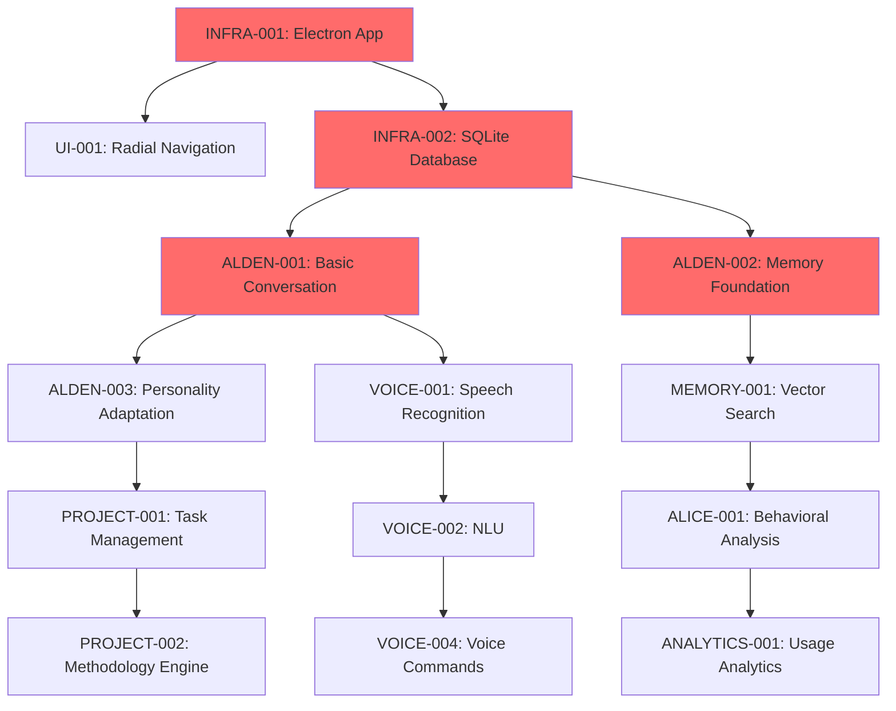

# Hearthlink Feature Map & Build Plan
## Source of Truth - v1.1.0

**Document Version:** 1.0.0  
**Last Updated:** July 13, 2025  
**Status:** Approved  
**Product Owner:** Development Team  
**Stakeholders:** Engineering, Product, QA, Design  

---

## 1. Executive Summary

### 1.1 Build Plan Overview
This document provides a comprehensive roadmap for Hearthlink development, mapping all features to their implementation phases, dependencies, and success criteria. The plan follows an iterative approach, delivering core functionality first and building toward advanced features.

### 1.2 Development Philosophy
- **MVP-First**: Deliver core value quickly, iterate based on user feedback
- **Local-First**: Complete local functionality before optional cloud features
- **Privacy-by-Design**: Privacy features are requirements, not optional additions
- **Accessibility-First**: Accessibility considerations in every feature
- **Agent-Centric**: Each major feature enhances agent capabilities

### 1.3 Release Timeline
```
Phase 1 (Months 1-2): Core Foundation & Alden
Phase 2 (Months 3-4): Multi-Agent System & Memory
Phase 3 (Months 5-6): Voice Interface & Project Command
Phase 4 (Months 7-8): Advanced Features & Integrations
Phase 5 (Months 9+): Extensions & Enterprise Features
```

---

## 2. Feature Classification System

### 2.1 Priority Levels
- **P0 (Critical)**: Must-have for MVP, blocks other features
- **P1 (High)**: Important for user satisfaction, competitive advantage
- **P2 (Medium)**: Nice-to-have, enhances experience
- **P3 (Low)**: Future consideration, not essential

### 2.2 Implementation Status
- **✅ Complete**: Fully implemented and tested
- **🚧 In Progress**: Currently being developed
- **📋 Planned**: Designed and scheduled
- **🔍 Research**: Requires investigation or prototyping
- **⏸️ Deferred**: Postponed to later phases

### 2.3 Complexity Estimates
- **S (Small)**: 1-3 days
- **M (Medium)**: 1-2 weeks
- **L (Large)**: 3-4 weeks
- **XL (Extra Large)**: 1-2 months

---

## 3. Phase 1: Core Foundation & Alden (Months 1-2)

### 3.1 Infrastructure & Platform (P0)

#### INFRA-001: Electron Desktop Application Framework
- **Status**: ✅ Complete
- **Complexity**: L
- **Description**: Cross-platform desktop application with React frontend
- **Acceptance Criteria**:
  - [ ] Electron app launches on Windows, macOS, Linux
  - [ ] React frontend renders correctly
  - [ ] IPC communication between main and renderer processes
  - [ ] Auto-updater mechanism functional
- **Dependencies**: None
- **Owner**: Platform Team

#### INFRA-002: Local Database System (SQLite)
- **Status**: ✅ Complete
- **Complexity**: M
- **Description**: SQLite database with schema management and migrations
- **Acceptance Criteria**:
  - [x] Database schema created and versioned
  - [x] Migration system for schema updates
  - [x] Connection pooling and performance optimization
  - [x] Data encryption for sensitive fields
- **Dependencies**: None
- **Owner**: Backend Team

#### INFRA-003: Configuration Management System
- **Status**: ✅ Complete
- **Complexity**: S
- **Description**: Hierarchical configuration system with environment support
- **Acceptance Criteria**:
  - [x] JSON-based configuration files
  - [x] Environment variable overrides
  - [x] Runtime configuration updates
  - [x] Configuration validation
- **Dependencies**: INFRA-002
- **Owner**: Backend Team

### 3.2 Core Alden Agent (P0)

#### ALDEN-001: Basic Conversational Interface
- **Status**: ✅ Complete
- **Complexity**: L
- **Description**: Core Alden AI with natural language processing
- **Acceptance Criteria**:
  - [x] Text-based conversation interface
  - [x] Context-aware responses using local LLM
  - [x] Session management and conversation history
  - [x] Error handling and graceful degradation
- **Dependencies**: INFRA-001, INFRA-002, LLM-001
- **Owner**: AI Team

#### ALDEN-002: Memory System Foundation
- **Status**: ✅ Complete
- **Complexity**: L
- **Description**: Basic memory storage and retrieval for Alden
- **Acceptance Criteria**:
  - [x] Memory slice creation and storage
  - [x] Basic memory search and retrieval
  - [x] Memory importance scoring
  - [x] User-controlled memory management
- **Dependencies**: INFRA-002, ALDEN-001
- **Owner**: AI Team

#### ALDEN-003: Personality Adaptation System
- **Status**: ✅ Complete
- **Complexity**: M
- **Description**: Adaptive personality traits based on user interactions
- **Acceptance Criteria**:
  - [x] Big Five personality trait modeling
  - [x] Trait adaptation based on user feedback
  - [x] Personality-driven response generation
  - [x] User-visible personality dashboard
- **Dependencies**: ALDEN-001, ALDEN-002
- **Owner**: AI Team

### 3.3 User Interface Foundation (P0)

#### UI-001: Radial Navigation System
- **Status**: ✅ Complete
- **Complexity**: M
- **Description**: Primary navigation paradigm with nested menus
- **Acceptance Criteria**:
  - [x] Radial menu with 5 main categories
  - [x] Nested submenu support (3 items per category)
  - [x] Smooth animations and transitions
  - [x] Keyboard navigation support
- **Dependencies**: INFRA-001
- **Owner**: Frontend Team

#### UI-002: StarCraft-Themed Interface
- **Status**: ✅ Complete
- **Complexity**: M
- **Description**: Cohesive visual design with sci-fi aesthetic
- **Acceptance Criteria**:
  - [x] StarCraft-inspired color scheme and typography
  - [x] Consistent styling across all components
  - [x] Dark theme with cyan accents
  - [x] Responsive design for different screen sizes
- **Dependencies**: UI-001
- **Owner**: Design Team

#### UI-003: Chat Interface
- **Status**: ✅ Complete
- **Complexity**: S
- **Description**: Conversation interface for agent communication
- **Acceptance Criteria**:
  - [x] Message threading and history
  - [x] Typing indicators and status
  - [x] Message timestamps and metadata
  - [x] Memory context display
- **Dependencies**: UI-001, ALDEN-001
- **Owner**: Frontend Team

### 3.4 LLM Integration (P0)

#### LLM-001: Local LLM Backend
- **Status**: ✅ Complete
- **Complexity**: L
- **Description**: Integration with local LLM providers (Ollama, llama.cpp)
- **Acceptance Criteria**:
  - [x] Multiple LLM backend support
  - [x] Model loading and management
  - [x] Response generation with context
  - [x] Fallback mechanisms for model failures
- **Dependencies**: INFRA-003
- **Owner**: AI Team

---

## 4. Phase 2: Multi-Agent System & Memory (Months 3-4)

### 4.1 Additional Agents (P1)

#### ALICE-001: Behavioral Analysis Agent
- **Status**: 📋 Planned
- **Complexity**: L
- **Description**: Agent for analyzing user communication patterns and behavior
- **Acceptance Criteria**:
  - [ ] Communication cadence and tone analysis
  - [ ] Emotional state detection and tracking
  - [ ] Behavioral pattern identification
  - [ ] Coaching recommendations for Alden
- **Dependencies**: ALDEN-001, MEMORY-002
- **Owner**: AI Team

#### ALICE-002: Context Awareness Engine
- **Status**: 📋 Planned
- **Complexity**: M
- **Description**: Deep context understanding for enhanced communication
- **Acceptance Criteria**:
  - [ ] Session context tracking and analysis
  - [ ] Multi-turn conversation understanding
  - [ ] Context switching detection
  - [ ] Proactive context suggestions
- **Dependencies**: ALICE-001, MEMORY-003
- **Owner**: AI Team

#### MIMIC-001: Adaptive Persona Framework
- **Status**: 📋 Planned
- **Complexity**: L
- **Description**: Dynamic persona switching and role-playing agent
- **Acceptance Criteria**:
  - [ ] Multiple persona definitions and switching
  - [ ] Role-based response generation
  - [ ] Persona consistency maintenance
  - [ ] User-controlled persona management
- **Dependencies**: ALDEN-001, LLM-001
- **Owner**: AI Team

#### SENTRY-001: Security Monitoring Agent
- **Status**: 📋 Planned
- **Complexity**: M
- **Description**: Security oversight and compliance monitoring
- **Acceptance Criteria**:
  - [ ] Real-time security event monitoring
  - [ ] Threat detection and alerting
  - [ ] Access control enforcement
  - [ ] Audit trail generation
- **Dependencies**: INFRA-002, SECURITY-001
- **Owner**: Security Team

### 4.2 Advanced Memory System (P1)

#### MEMORY-001: Vector Search Enhancement
- **Status**: 📋 Planned
- **Complexity**: M
- **Description**: Semantic memory search using vector embeddings
- **Acceptance Criteria**:
  - [ ] Text embedding generation and storage
  - [ ] Similarity search implementation
  - [ ] Memory ranking by relevance and importance
  - [ ] Performance optimization for large memory sets
- **Dependencies**: ALDEN-002, LLM-001
- **Owner**: AI Team

#### MEMORY-002: Memory Types and Classification
- **Status**: 📋 Planned
- **Complexity**: S
- **Description**: Enhanced memory categorization system
- **Acceptance Criteria**:
  - [ ] Episodic memory (events and experiences)
  - [ ] Semantic memory (facts and knowledge)
  - [ ] Procedural memory (habits and workflows)
  - [ ] Automatic memory classification
- **Dependencies**: MEMORY-001
- **Owner**: AI Team

#### MEMORY-003: Cross-Agent Memory Sharing
- **Status**: 📋 Planned
- **Complexity**: M
- **Description**: Secure memory sharing between agents with permissions
- **Acceptance Criteria**:
  - [ ] Agent-specific memory isolation
  - [ ] Permission-based memory sharing
  - [ ] Memory access auditing
  - [ ] User-controlled sharing settings
- **Dependencies**: ALICE-001, MIMIC-001, SENTRY-001
- **Owner**: AI Team

### 4.3 Agent Orchestration (P1)

#### CORE-001: Inter-Agent Communication
- **Status**: 📋 Planned
- **Complexity**: M
- **Description**: Message bus and coordination system for multiple agents
- **Acceptance Criteria**:
  - [ ] Agent registration and discovery
  - [ ] Message routing and delivery
  - [ ] Event publishing and subscription
  - [ ] Communication security and validation
- **Dependencies**: ALICE-001, MIMIC-001, SENTRY-001
- **Owner**: Backend Team

#### CORE-002: Agent Handoff System
- **Status**: 📋 Planned
- **Complexity**: S
- **Description**: Seamless handoffs between agents based on task type
- **Acceptance Criteria**:
  - [ ] Automatic agent selection based on query type
  - [ ] Manual agent switching by user request
  - [ ] Context preservation during handoffs
  - [ ] Handoff reason explanation to user
- **Dependencies**: CORE-001
- **Owner**: Backend Team

#### CORE-003: Session Management
- **Status**: 📋 Planned
- **Complexity**: S
- **Description**: Enhanced session tracking across multiple agents
- **Acceptance Criteria**:
  - [ ] Multi-agent session context
  - [ ] Session persistence and recovery
  - [ ] Agent participation tracking
  - [ ] Session analytics and insights
- **Dependencies**: CORE-001, MEMORY-003
- **Owner**: Backend Team

---

## 5. Phase 3: Voice Interface & Project Command (Months 5-6)

### 5.1 Voice Processing System (P1)

#### VOICE-001: Speech Recognition
- **Status**: 🔍 Research
- **Complexity**: L
- **Description**: High-accuracy speech-to-text with offline capability
- **Acceptance Criteria**:
  - [ ] Web Speech API integration
  - [ ] Offline speech recognition fallback
  - [ ] Multi-language support (English priority)
  - [ ] Noise cancellation and audio processing
- **Dependencies**: INFRA-001
- **Owner**: Voice Team

#### VOICE-002: Natural Language Understanding
- **Status**: 🔍 Research
- **Complexity**: M
- **Description**: Intent recognition and entity extraction from speech
- **Acceptance Criteria**:
  - [ ] Intent classification for common commands
  - [ ] Entity extraction (dates, names, tasks)
  - [ ] Context-aware command interpretation
  - [ ] Confidence scoring and ambiguity handling
- **Dependencies**: VOICE-001, LLM-001
- **Owner**: AI Team

#### VOICE-003: Text-to-Speech
- **Status**: 📋 Planned
- **Complexity**: S
- **Description**: Natural speech synthesis for agent responses
- **Acceptance Criteria**:
  - [ ] Multiple voice options for different agents
  - [ ] Adjustable speech rate and tone
  - [ ] SSML support for enhanced expression
  - [ ] Offline TTS capability
- **Dependencies**: None
- **Owner**: Voice Team

#### VOICE-004: Voice Command System
- **Status**: 📋 Planned
- **Complexity**: M
- **Description**: Comprehensive voice command recognition and execution
- **Acceptance Criteria**:
  - [ ] Core navigation commands
  - [ ] Agent-specific commands
  - [ ] System control commands
  - [ ] Custom command creation by users
- **Dependencies**: VOICE-001, VOICE-002, CORE-002
- **Owner**: Voice Team

### 5.2 Project Command Module (P1)

#### PROJECT-001: Task Management System
- **Status**: 📋 Planned
- **Complexity**: L
- **Description**: Intelligent task creation, organization, and tracking
- **Acceptance Criteria**:
  - [ ] Natural language task creation
  - [ ] Task breakdown and subtask generation
  - [ ] Priority assignment and scheduling
  - [ ] Progress tracking and completion
- **Dependencies**: ALDEN-001, MEMORY-002
- **Owner**: Product Team

#### PROJECT-002: Methodology Engine
- **Status**: 📋 Planned
- **Complexity**: M
- **Description**: Project methodology recommendation and adaptation
- **Acceptance Criteria**:
  - [ ] Multiple methodology support (Agile, Kanban, GTD)
  - [ ] Automatic methodology recommendation
  - [ ] Methodology switching with rationale
  - [ ] Custom methodology creation
- **Dependencies**: PROJECT-001, MIMIC-001
- **Owner**: Product Team

#### PROJECT-003: Goal Tracking System
- **Status**: 📋 Planned
- **Complexity**: S
- **Description**: Long-term goal setting and progress monitoring
- **Acceptance Criteria**:
  - [ ] SMART goal creation and validation
  - [ ] Goal decomposition into actionable tasks
  - [ ] Progress visualization and reporting
  - [ ] Goal achievement celebration and reflection
- **Dependencies**: PROJECT-001, MEMORY-002
- **Owner**: Product Team

#### PROJECT-004: Retrospective and Learning
- **Status**: 📋 Planned
- **Complexity**: S
- **Description**: Project reflection and continuous improvement
- **Acceptance Criteria**:
  - [ ] Automated retrospective prompts
  - [ ] Pattern recognition in project outcomes
  - [ ] Learning integration into future projects
  - [ ] Methodology effectiveness analysis
- **Dependencies**: PROJECT-002, ALICE-001
- **Owner**: Product Team

### 5.3 Enhanced UI Features (P1)

#### UI-004: Voice Interface Overlay
- **Status**: 📋 Planned
- **Complexity**: M
- **Description**: Visual feedback for voice interactions
- **Acceptance Criteria**:
  - [ ] Voice activation visual indicator
  - [ ] Real-time speech-to-text display
  - [ ] Voice command confirmation
  - [ ] Audio level and quality indicators
- **Dependencies**: VOICE-001, UI-001
- **Owner**: Frontend Team

#### UI-005: Memory Management Interface
- **Status**: 📋 Planned
- **Complexity**: M
- **Description**: User interface for viewing and managing memories
- **Acceptance Criteria**:
  - [ ] Memory search and filtering
  - [ ] Memory editing and deletion
  - [ ] Memory importance adjustment
  - [ ] Memory export and import
- **Dependencies**: MEMORY-001, UI-001
- **Owner**: Frontend Team

#### UI-006: Agent Personality Dashboard
- **Status**: 📋 Planned
- **Complexity**: S
- **Description**: Visual representation of agent personalities and traits
- **Acceptance Criteria**:
  - [ ] Personality trait visualization
  - [ ] Trait evolution over time
  - [ ] User-controlled personality adjustments
  - [ ] Agent comparison interface
- **Dependencies**: ALDEN-003, ALICE-001, UI-001
- **Owner**: Frontend Team

---

## 6. Phase 4: Advanced Features & Integrations (Months 7-8)

### 6.1 Security & Privacy (P1)

#### SECURITY-001: Synapse Gateway
- **Status**: 📋 Planned
- **Complexity**: L
- **Description**: Secure external API gateway with sandboxing
- **Acceptance Criteria**:
  - [ ] Request filtering and validation
  - [ ] Response sanitization
  - [ ] API key management and encryption
  - [ ] Rate limiting and abuse prevention
- **Dependencies**: SENTRY-001
- **Owner**: Security Team

#### SECURITY-002: Credential Manager
- **Status**: 📋 Planned
- **Complexity**: M
- **Description**: Encrypted storage and management of user credentials
- **Acceptance Criteria**:
  - [ ] AES-256 encryption for stored credentials
  - [ ] Secure credential injection into requests
  - [ ] Credential sharing between agents (controlled)
  - [ ] Master password protection
- **Dependencies**: SECURITY-001
- **Owner**: Security Team

#### SECURITY-003: Audit and Compliance
- **Status**: 📋 Planned
- **Complexity**: S
- **Description**: Comprehensive audit logging and compliance reporting
- **Acceptance Criteria**:
  - [ ] Complete action audit trail
  - [ ] Privacy compliance validation
  - [ ] Security event monitoring
  - [ ] Compliance report generation
- **Dependencies**: SENTRY-001, SECURITY-001
- **Owner**: Security Team

### 6.2 System Integrations (P2)

#### INTEGRATION-001: File System Integration
- **Status**: 📋 Planned
- **Complexity**: S
- **Description**: Secure file access and manipulation capabilities
- **Acceptance Criteria**:
  - [ ] File reading and writing with permissions
  - [ ] Document summarization and analysis
  - [ ] File organization suggestions
  - [ ] Version control integration (Git)
- **Dependencies**: SECURITY-001
- **Owner**: Integration Team

#### INTEGRATION-002: Calendar Integration
- **Status**: 📋 Planned
- **Complexity**: M
- **Description**: Calendar system integration for scheduling and planning
- **Acceptance Criteria**:
  - [ ] Calendar event reading and creation
  - [ ] Meeting preparation assistance
  - [ ] Schedule optimization suggestions
  - [ ] Multiple calendar provider support
- **Dependencies**: SECURITY-001, PROJECT-001
- **Owner**: Integration Team

#### INTEGRATION-003: Email Integration
- **Status**: 📋 Planned
- **Complexity**: M
- **Description**: Email processing and management assistance
- **Acceptance Criteria**:
  - [ ] Email summarization and prioritization
  - [ ] Draft generation and suggestions
  - [ ] Follow-up tracking and reminders
  - [ ] IMAP/Exchange protocol support
- **Dependencies**: SECURITY-001, ALICE-001
- **Owner**: Integration Team

#### INTEGRATION-004: Web Browser Integration
- **Status**: 📋 Planned
- **Complexity**: L
- **Description**: Web content analysis and interaction assistance
- **Acceptance Criteria**:
  - [ ] Web page summarization
  - [ ] Research assistance and fact-checking
  - [ ] Form filling automation
  - [ ] Bookmark and reading list management
- **Dependencies**: SECURITY-001, INTEGRATION-001
- **Owner**: Integration Team

### 6.3 Analytics and Insights (P2)

#### ANALYTICS-001: Usage Analytics
- **Status**: 📋 Planned
- **Complexity**: S
- **Description**: Privacy-preserving usage analytics and insights
- **Acceptance Criteria**:
  - [ ] Local-only analytics processing
  - [ ] User behavior pattern analysis
  - [ ] Feature usage tracking
  - [ ] Performance metrics collection
- **Dependencies**: ALICE-001, MEMORY-003
- **Owner**: Analytics Team

#### ANALYTICS-002: Productivity Insights
- **Status**: 📋 Planned
- **Complexity**: M
- **Description**: Personalized productivity analysis and recommendations
- **Acceptance Criteria**:
  - [ ] Time usage analysis and optimization
  - [ ] Goal achievement tracking
  - [ ] Productivity trend identification
  - [ ] Personalized improvement suggestions
- **Dependencies**: PROJECT-003, ANALYTICS-001
- **Owner**: Analytics Team

#### ANALYTICS-003: Learning Analytics
- **Status**: 📋 Planned
- **Complexity**: S
- **Description**: Analysis of learning patterns and knowledge acquisition
- **Acceptance Criteria**:
  - [ ] Knowledge gap identification
  - [ ] Learning progress tracking
  - [ ] Skill development recommendations
  - [ ] Memory retention analysis
- **Dependencies**: MEMORY-002, ANALYTICS-001
- **Owner**: Analytics Team

---

## 7. Phase 5: Extensions & Enterprise Features (Months 9+)

### 7.1 Plugin Architecture (P2)

#### PLUGIN-001: Plugin Framework
- **Status**: ⏸️ Deferred
- **Complexity**: XL
- **Description**: Third-party plugin development and execution framework
- **Acceptance Criteria**:
  - [ ] Plugin API specification and SDK
  - [ ] Secure plugin execution environment
  - [ ] Plugin discovery and installation
  - [ ] Plugin permission management
- **Dependencies**: SECURITY-001, CORE-001
- **Owner**: Platform Team

#### PLUGIN-002: Core Plugin Library
- **Status**: ⏸️ Deferred
- **Complexity**: L
- **Description**: Essential plugins for common productivity tools
- **Acceptance Criteria**:
  - [ ] Task management plugins (Todoist, Things, etc.)
  - [ ] Note-taking plugins (Obsidian, Notion, etc.)
  - [ ] Communication plugins (Slack, Teams, etc.)
  - [ ] Development tool plugins (IDE, Git, etc.)
- **Dependencies**: PLUGIN-001
- **Owner**: Integration Team

### 7.2 Collaboration Features (P3)

#### COLLAB-001: Shared Workspaces
- **Status**: ⏸️ Deferred
- **Complexity**: XL
- **Description**: Privacy-preserving collaborative workspaces
- **Acceptance Criteria**:
  - [ ] Encrypted workspace sharing
  - [ ] Collaborative project management
  - [ ] Shared knowledge bases
  - [ ] Real-time collaboration tools
- **Dependencies**: SECURITY-002, PROJECT-001
- **Owner**: Product Team

#### COLLAB-002: Team Agent Coordination
- **Status**: ⏸️ Deferred
- **Complexity**: L
- **Description**: Multi-user agent coordination and delegation
- **Acceptance Criteria**:
  - [ ] Team agent assignment and management
  - [ ] Cross-user task delegation
  - [ ] Team productivity analytics
  - [ ] Role-based access control
- **Dependencies**: COLLAB-001, CORE-001
- **Owner**: Product Team

### 7.3 Mobile Platform (P3)

#### MOBILE-001: Mobile Companion App
- **Status**: ⏸️ Deferred
- **Complexity**: XL
- **Description**: iOS/Android companion app with limited functionality
- **Acceptance Criteria**:
  - [ ] Quick note capture and voice memos
  - [ ] Notification and reminder system
  - [ ] Basic agent interaction
  - [ ] Secure data synchronization
- **Dependencies**: SECURITY-002, VOICE-001
- **Owner**: Mobile Team

#### MOBILE-002: Offline Synchronization
- **Status**: ⏸️ Deferred
- **Complexity**: M
- **Description**: Offline-first mobile experience with sync
- **Acceptance Criteria**:
  - [ ] Offline data storage and processing
  - [ ] Conflict resolution during sync
  - [ ] Incremental synchronization
  - [ ] Data compression and optimization
- **Dependencies**: MOBILE-001
- **Owner**: Mobile Team

---

## 8. Feature Dependencies Matrix

### 8.1 Critical Path Analysis


### 8.2 Dependency Table
| Feature | Direct Dependencies | Blocking Features |
|---------|-------------------|------------------|
| INFRA-001 | None | UI-001, VOICE-001 |
| INFRA-002 | None | ALDEN-001, MEMORY-001 |
| ALDEN-001 | INFRA-001, INFRA-002 | ALICE-001, PROJECT-001 |
| MEMORY-001 | ALDEN-002, LLM-001 | ALICE-001, ANALYTICS-001 |
| VOICE-001 | INFRA-001 | VOICE-002, UI-004 |
| PROJECT-001 | ALDEN-001, MEMORY-002 | PROJECT-002, ANALYTICS-002 |
| SECURITY-001 | SENTRY-001 | INTEGRATION-001, PLUGIN-001 |

---

## 9. Risk Assessment & Mitigation

### 9.1 Technical Risks

#### HIGH RISK: Local LLM Performance
- **Risk**: Local LLM models insufficient for quality user experience
- **Impact**: Core functionality degraded, user satisfaction low
- **Probability**: Medium
- **Mitigation**: 
  - Extensive model testing and optimization
  - Multiple model backend support
  - Cloud LLM fallback options
  - Progressive model enhancement
- **Owner**: AI Team
- **Monitoring**: Response quality metrics, user satisfaction scores

#### MEDIUM RISK: Voice Recognition Accuracy
- **Risk**: Speech recognition fails for diverse accents and environments
- **Impact**: Accessibility issues, reduced usability
- **Probability**: Medium
- **Mitigation**:
  - Multiple voice engine support
  - User-specific voice training
  - Noise cancellation algorithms
  - Keyboard navigation fallbacks
- **Owner**: Voice Team
- **Monitoring**: Voice command success rates, user feedback

#### MEDIUM RISK: Memory System Scalability
- **Risk**: Memory search becomes slow with large datasets
- **Impact**: Poor user experience, system unresponsiveness
- **Probability**: Low
- **Mitigation**:
  - Efficient indexing strategies
  - Memory importance-based pruning
  - Background optimization processes
  - User-controlled memory limits
- **Owner**: AI Team
- **Monitoring**: Query response times, memory size metrics

### 9.2 Product Risks

#### HIGH RISK: Feature Complexity Overwhelm
- **Risk**: Too many features confuse users, reduce adoption
- **Impact**: Poor user experience, high churn
- **Probability**: Medium
- **Mitigation**:
  - Progressive feature disclosure
  - Comprehensive onboarding
  - User testing at each phase
  - Feature usage analytics
- **Owner**: Product Team
- **Monitoring**: Feature adoption rates, user feedback

#### MEDIUM RISK: Privacy Concerns
- **Risk**: Users don't trust local-first claims
- **Impact**: Reduced adoption, competitive disadvantage
- **Probability**: Low
- **Mitigation**:
  - Transparent privacy documentation
  - Open source key components
  - Third-party security audits
  - Clear data control interfaces
- **Owner**: Security Team
- **Monitoring**: User surveys, privacy setting usage

### 9.3 Resource Risks

#### MEDIUM RISK: Development Timeline Delays
- **Risk**: Complex features take longer than estimated
- **Impact**: Delayed launches, increased costs
- **Probability**: High
- **Mitigation**:
  - Conservative time estimates
  - Parallel development streams
  - MVP-first approach
  - Regular milestone reviews
- **Owner**: Engineering Management
- **Monitoring**: Sprint velocity, milestone completion

---

## 10. Success Metrics & Validation

### 10.1 Feature-Level Success Criteria

#### Core Agent Features
| Feature | Success Metric | Target | Measurement |
|---------|---------------|--------|-------------|
| ALDEN-001 | Response relevance score | >4.0/5.0 | User ratings |
| ALDEN-003 | Personality adaptation rate | >80% user satisfaction | Surveys |
| MEMORY-001 | Memory retrieval accuracy | >85% relevant results | Automated testing |
| VOICE-001 | Command recognition accuracy | >95% for trained users | Error rate analysis |

#### User Experience Features
| Feature | Success Metric | Target | Measurement |
|---------|---------------|--------|-------------|
| UI-001 | Navigation efficiency | <3 clicks to any feature | User journey analysis |
| UI-004 | Voice interface adoption | >60% of users try voice | Usage analytics |
| PROJECT-001 | Task completion improvement | +40% vs baseline | Before/after comparison |

#### Technical Features
| Feature | Success Metric | Target | Measurement |
|---------|---------------|--------|-------------|
| INFRA-002 | Database query performance | <50ms average | Performance monitoring |
| SECURITY-001 | Security incident rate | Zero critical incidents | Security logs |
| ANALYTICS-001 | Insight accuracy | >90% user agreement | Validation surveys |

### 10.2 Phase-Level Success Gates

#### Phase 1 Completion Criteria
- [ ] All P0 features implemented and tested
- [ ] Core Alden functionality validated with 50+ beta users
- [ ] Performance benchmarks met (response time <500ms)
- [ ] Security audit passed with no critical findings
- [ ] User satisfaction score >4.0/5.0

#### Phase 2 Completion Criteria
- [ ] Multi-agent system operational
- [ ] Advanced memory features validated
- [ ] Agent handoff system working smoothly
- [ ] User retention >70% after 30 days
- [ ] Feature adoption >50% for new capabilities

#### Phase 3 Completion Criteria
- [ ] Voice interface functional and accurate
- [ ] Project Command module delivering productivity gains
- [ ] Voice command success rate >90%
- [ ] Task completion improvement >30%
- [ ] Accessibility compliance validated

### 10.3 Overall Product Success Metrics

#### User Engagement
- **Daily Active Users**: 70% of registered users
- **Session Length**: 45+ minutes productive usage
- **Feature Adoption**: 80% try voice interface within first week
- **Retention**: 80% at 30 days, 60% at 90 days

#### Product Quality
- **User Satisfaction**: NPS >50, App Store rating >4.5
- **Performance**: 95th percentile response time <1s
- **Reliability**: <0.1% crash rate, 99.9% uptime
- **Support**: <5% of users need support monthly

#### Business Impact
- **Productivity Improvement**: 40% better task completion
- **User Value**: >$200 lifetime value per user
- **Market Position**: Top 3 in privacy-focused AI tools
- **Growth**: 100% month-over-month user growth

---

## 11. Implementation Guidelines

### 11.1 Development Workflow

#### 11.1.1 Feature Development Process
```
1. Feature Specification
   - Write detailed technical specification
   - Define acceptance criteria and test cases
   - Review with stakeholders and technical team
   - Estimate effort and identify dependencies

2. Design Review
   - Create UI mockups and user flows
   - Review accessibility considerations
   - Validate security and privacy requirements
   - Get design approval from product team

3. Implementation
   - Create feature branch from develop
   - Implement core functionality
   - Write comprehensive tests
   - Document APIs and usage

4. Testing & Quality Assurance
   - Unit tests with >80% coverage
   - Integration tests for all interfaces
   - Manual testing by QA team
   - Performance testing and optimization

5. Review & Integration
   - Code review by senior developers
   - Security review for sensitive features
   - Merge to develop branch
   - Deploy to staging environment

6. User Validation
   - Beta testing with target users
   - Gather feedback and usage metrics
   - Iterate based on user feedback
   - Final approval for production
```

#### 11.1.2 Quality Gates
```yaml
Code Quality:
  - Test Coverage: >80% for all new code
  - Code Review: Required by 2+ senior developers
  - Static Analysis: No critical or high-severity issues
  - Performance: No regressions in benchmark tests

Security:
  - Security Review: Required for all user-facing features
  - Penetration Testing: For external interfaces
  - Privacy Impact: Assessment for data-handling features
  - Audit Trail: Complete logging for sensitive operations

User Experience:
  - Usability Testing: With 5+ target users
  - Accessibility: WCAG 2.1 AA compliance validated
  - Performance: <500ms response time for interactive features
  - Documentation: User-facing features fully documented
```

### 11.2 Release Management

#### 11.2.1 Release Strategy
- **Major Releases**: Every 3 months with new phases
- **Minor Releases**: Monthly with feature additions
- **Patch Releases**: Weekly with bug fixes and improvements
- **Hotfix Releases**: As needed for critical issues

#### 11.2.2 Deployment Pipeline
```
Development → Staging → Beta → Production

Development:
- Continuous integration testing
- Automated security scanning
- Performance benchmarking
- Code quality validation

Staging:
- Full integration testing
- Load testing and performance validation
- Security penetration testing
- User acceptance testing

Beta:
- Limited user group (100-1000 users)
- Real-world usage validation
- Feedback collection and analysis
- Performance monitoring

Production:
- Gradual rollout to all users
- Real-time monitoring and alerting
- User support and feedback collection
- Performance and usage analytics
```

---

## 12. Resource Planning

### 12.1 Team Structure

#### 12.1.1 Core Development Teams
**Frontend Team (3 developers)**
- React/TypeScript expertise
- UI/UX implementation
- Accessibility compliance
- Performance optimization

**Backend Team (3 developers)**
- Python/FastAPI expertise
- Database design and optimization
- API development
- System architecture

**AI Team (2 developers)**
- LLM integration and optimization
- Memory system development
- Agent behavior implementation
- Natural language processing

**Voice Team (2 developers)**
- Speech recognition integration
- Audio processing
- Voice UI development
- Accessibility for voice

**Security Team (2 developers)**
- Security architecture
- Encryption and privacy
- Audit and compliance
- Threat modeling

**Platform Team (2 developers)**
- Electron application framework
- Build and deployment systems
- Performance monitoring
- DevOps and infrastructure

#### 12.1.2 Supporting Teams
**Product Management (1 PM)**
- Feature prioritization and roadmap
- User research and feedback analysis
- Stakeholder communication
- Success metrics tracking

**Design Team (1 designer)**
- UI/UX design and prototyping
- User journey optimization
- Accessibility design
- Brand and visual consistency

**QA Team (2 testers)**
- Manual and automated testing
- User acceptance testing
- Performance and security testing
- Bug tracking and verification

### 12.2 Timeline and Milestones

#### 12.2.1 Detailed Phase Timeline
```
Phase 1: Core Foundation (Weeks 1-8)
  Week 1-2: Infrastructure setup and basic Electron app
  Week 3-4: SQLite database and configuration system
  Week 5-6: Core Alden agent and LLM integration
  Week 7-8: Basic UI and memory system

Phase 2: Multi-Agent System (Weeks 9-16)
  Week 9-10: Alice agent foundation
  Week 11-12: Mimic and Sentry agents
  Week 13-14: Advanced memory system
  Week 15-16: Agent coordination and handoffs

Phase 3: Voice & Project Command (Weeks 17-24)
  Week 17-18: Speech recognition and NLU
  Week 19-20: Voice command system
  Week 21-22: Project Command module
  Week 23-24: Voice interface UI and integration

Phase 4: Advanced Features (Weeks 25-32)
  Week 25-26: Security and Synapse gateway
  Week 27-28: System integrations
  Week 29-30: Analytics and insights
  Week 31-32: Polish and optimization

Phase 5: Extensions (Weeks 33+)
  Week 33-36: Plugin architecture
  Week 37-40: Collaboration features
  Week 41-44: Mobile companion app
  Ongoing: Maintenance and feature additions
```

#### 12.2.2 Key Milestones
- **Week 8**: Phase 1 complete - Core Alden functional
- **Week 16**: Phase 2 complete - Multi-agent system operational
- **Week 24**: Phase 3 complete - Voice interface and Project Command
- **Week 32**: Phase 4 complete - Advanced features and integrations
- **Week 40**: Beta release ready
- **Week 48**: General availability launch

---

## 13. Appendices

### Appendix A: Feature Specifications Template
[Detailed template for feature specification documents]

### Appendix B: Test Case Templates
[Standard test case formats for different feature types]

### Appendix C: Security Review Checklist
[Comprehensive security validation checklist]

### Appendix D: Performance Benchmarks
[Performance targets and measurement procedures]

### Appendix E: User Research Protocols
[Standard procedures for user testing and feedback collection]

---

**Document Control**
- **Version**: 1.0.0
- **Classification**: Internal Use
- **Review Cycle**: Bi-weekly during active development
- **Next Review**: July 27, 2025
- **Owner**: Product Management
- **Approvers**: Engineering Leadership, Product Leadership

---

*This Feature Map & Build Plan serves as the comprehensive roadmap for Hearthlink development. All feature development should align with the priorities, dependencies, and success criteria defined herein. Regular updates will be made to reflect progress and changing requirements.*